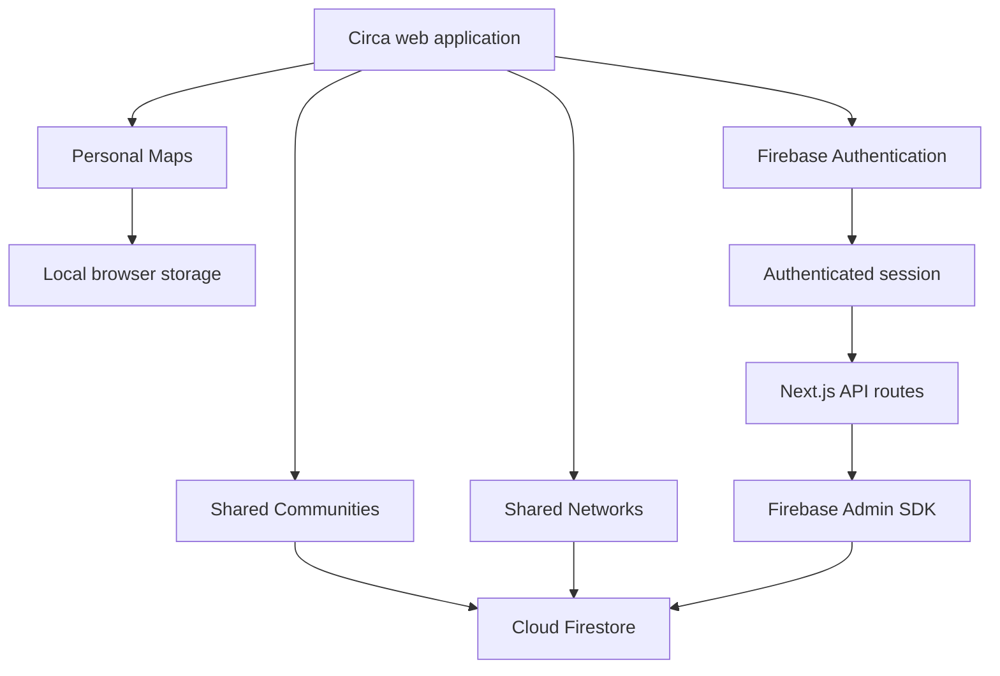

# Circa

> A visual relationship-mapping platform for understanding how people, communities and professional networks are connected.

**Circa is currently in public beta.**
/)

---

## Overview

Circa helps people visually organise and understand the relationships around them.

Users can create personal relationship maps, organise people into groups, define connections and explore how individuals are connected. Circa also supports shared, invitation-only Communities and Networks for structured collaboration.

The platform began as a local-first relationship-mapping prototype. It has since developed into an authenticated, cloud-backed product with secure invitations, community directories, member roles, moderation and collaborative features.

**Made for understanding, never ranking.**

---

## The problem Circa solves

Important information about people and relationships is often scattered across contact lists, messages, spreadsheets and social platforms.

In communities, useful recommendations—such as details for plumbers, electricians, cleaners or handymen—can quickly become buried inside old group-chat messages.

In professional settings, it can also be difficult to understand:

- Who knows whom
- How an introduction was made
- Which people belong to a team
- Who reports to whom
- How different groups are connected
- Where useful contacts and recommendations are stored

Circa brings this information into a focused visual and structured workspace.

---

## Ways to use Circa

| Workspace | Sign-in | Storage | Purpose |
|---|---:|---|---|
| Personal Maps | Not required | Stored locally in the browser | Private relationship mapping and experimentation |
| Communities | Required | Secure cloud storage | Invitation-only neighbourhood or interest-based spaces |
| Networks | Required | Secure cloud storage | Professional contacts, introductions and relationships |

---

## Personal Maps

Personal Maps are private, local-first workspaces for visually organising relationships.

Users can:

- Add, move and connect people on an interactive canvas
- Define different relationship types
- Organise people into groups
- Add roles, contact information and contextual notes
- Create personal, family, school, business or custom maps
- Build professional connection maps
- Create organisational charts and reporting structures
- Import people from supported files
- Export and restore workspace backups

Personal Map data remains in the user’s browser unless the user explicitly exports it.

---

## Shared Communities

Circa Communities are private, invitation-only spaces designed for groups such as neighbourhoods, estates and local organisations.

Community features include:

- Secure member accounts
- Invitation links and QR-code joining
- Owners, administrators and member roles
- Custom community sections
- Local contact and service directories
- Community notices
- Recommendations and requests
- Events and activities
- Neighbourhood help
- Lost-and-found posts
- Marketplace and giveaway sections
- Member-submitted proposals
- Approval and moderation workflows
- Controlled updates to published information
- Secure deletion of owned Communities

Members can suggest additions, corrections or removals without directly changing published information. Proposed changes can be reviewed before they become visible to the wider Community.

---

## Shared Networks

Circa Networks help users organise professional relationships and understand how people are connected.

Networks can be used to record:

- Professional contacts
- Colleagues and team members
- Mentors
- Introductions
- Departments and roles
- Reporting relationships
- Mutual connections
- Context about how people know each other

Shared Networks use authenticated cloud storage and controlled member access.

---

## Compose and Ask

### Compose

Compose allows users to describe relationships using natural language.

For example:

> Maya leads the frontend team and Daniel leads the backend team. They both report to James. Maya introduced me to Priya.

Circa interprets the people, roles and relationships, then generates a structured proposal for the user to review before making changes.

### Ask

Ask works from the relationship information already stored in a map.

Example questions include:

- How is Maya connected to James?
- Who is Priya connected to?
- Who introduced Daniel to Maya?
- Which people belong to the frontend team?

Circa analyses the relationship graph and highlights the relevant people and connection paths.

---

## First community pilot

Circa’s first real-world Community pilot was created for residents of **The Mount estate on Heathside in Prestwich, Manchester**.

The pilot addresses a recurring community problem: useful recommendations for local trades and services becoming buried inside group-chat conversations.

The initial Community includes:

- A structured directory of 40 community-sourced service contacts
- Categories such as plumbing, electrical work, cleaning and gardening
- Member suggestions and corrections
- Review and approval before publication
- Private invitation-only access
- Community notices, events and neighbourhood support sections

The first seven residents joined during the initial beta launch.

Community recommendations are not professional verification. Users should independently confirm identity, pricing, availability, insurance, qualifications, Gas Safe registration and electrical certification where relevant.

---

## Technology

### Frontend

- Next.js
- React
- TypeScript
- Next.js App Router
- Responsive custom interface
- Interactive relationship visualisation

### Authentication and data

- Firebase Authentication
- Google sign-in
- Email and password authentication
- Cloud Firestore
- Firebase Admin SDK
- Firebase App Check integration
- Firestore security rules

### Infrastructure

- Netlify
- Netlify Functions
- GitHub
- Continuous deployment
- Environment-based configuration

### Quality and security

- TypeScript type checking
- Automated unit tests
- Firestore emulator tests
- Critical browser-journey tests
- Production build validation
- Secret and artifact scanning
- Privacy-conscious server logging
- Rate limiting
- Recent-authentication checks for sensitive actions
- Secure and retry-safe project deletion

---

## Application architecture



Personal Maps remain local by default. Shared Communities and Networks require authentication and use cloud-backed storage.

---

## Running Circa locally

### Prerequisites

Before starting, install:

- Node.js
- npm
- Git
- Firebase CLI for Firestore emulator testing

Use the Node.js version specified by the project configuration where available.

### Clone the repository

```bash
git clone https://github.com/shivamjambagi/Circa.git
cd Circa
```

### Install dependencies

```bash
npm install
```

### Configure environment variables

Create a `.env.local` file in the project root.

```env
NEXT_PUBLIC_FIREBASE_API_KEY=your_firebase_api_key
NEXT_PUBLIC_FIREBASE_AUTH_DOMAIN=your_firebase_auth_domain
NEXT_PUBLIC_FIREBASE_PROJECT_ID=your_firebase_project_id
NEXT_PUBLIC_FIREBASE_STORAGE_BUCKET=your_firebase_storage_bucket
NEXT_PUBLIC_FIREBASE_MESSAGING_SENDER_ID=your_messaging_sender_id
NEXT_PUBLIC_FIREBASE_APP_ID=your_firebase_app_id
NEXT_PUBLIC_FIREBASE_APPCHECK_SITE_KEY=your_app_check_site_key

FIREBASE_PROJECT_ID=your_firebase_project_id
FIREBASE_SERVICE_ACCOUNT_JSON=your_service_account_json
RATE_LIMIT_HMAC_SECRET=your_secure_random_secret
```

Generate a secure rate-limiting secret with:

```bash
node -e "console.log(require('node:crypto').randomBytes(32).toString('hex'))"
```

Never commit `.env.local`, Firebase service-account credentials or production secrets to GitHub.

### Start the development server

```bash
npm run dev
```

Open:

```text
http://localhost:3000
```

---

## Verification

Run the following checks before merging or deploying changes:

```bash
npm run typecheck
npm run lint
npm run test:unit
npm run test:firestore
npm run build
npm run scan:artifact
npm run test:critical
```

Some tests may require the Firebase Emulator Suite or additional local environment configuration.

---

## Production deployment

Circa is deployed through Netlify from the production branch.

Production environment variables must be configured for the relevant Netlify scopes and deployment contexts:

- Builds
- Functions
- Runtime
- Production
- Deploy previews, where required

After changing runtime environment variables, trigger a new deployment so the updated values are available to the deployed application.

The production deployment should only be considered ready when:

- The build passes
- Automated checks are green
- Authentication works
- Invitation joining works
- Community permissions are enforced
- Sensitive operations require recent authentication
- No secrets are exposed in client artifacts
- Production logs contain no private user information

---

## Privacy and safety

Circa follows a private-by-default approach:

- Personal Maps remain in local browser storage by default
- Shared spaces require authentication
- Communities are invitation-only
- Member roles control available actions
- Proposed Community changes can require approval
- Sensitive account actions require recent authentication
- Owned spaces can be securely deleted
- Server diagnostics avoid exposing private contact information
- Production secrets remain server-side

Users should not publish private Community invitation links, QR codes, phone numbers or resident information in public repositories, screenshots or social-media posts.

For more information, review the privacy information available inside the Circa application.

---

## Beta status

Circa is actively being developed and tested with real users.

Current priorities include:

- Improving member onboarding
- Learning from Community feedback
- Refining contact-directory workflows
- Strengthening moderation tools
- Improving accessibility and usability
- Expanding relationship intelligence
- Continuing security and privacy testing

Features, interfaces and data structures may change during the beta.

---

## Feedback

Feedback about the platform, design, usability or features is welcome.

Use the live beta:

### [https://circaa.netlify.app/](https://circaa.netlify.app/)

---

## Founder

Circa was designed and developed by **Shivam Jambagi**.

**Made for understanding, never ranking.**
